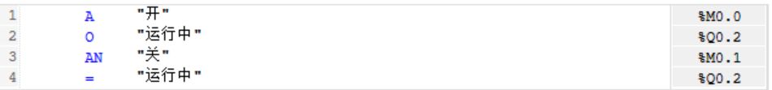

markdown
# 1. LAD - 梯形图

## 📖基本概念

- **起源**：由继电器控制系统电气原理图演变而来。
- **外观**：非常类似于传统的电气控制电路图。
- **核心元素**：常开触点 `||`、常闭触点 `|/|`、线圈 `( )`、功能块等。
- **执行**：从左到右，从上到下（"能流"概念）。

## 🖥️ 点灯语法示例

<pre>
含义：当M0.0为1时候，激活线圈Q0.2同时赋值Q0.2的常开触电为1达成自锁。
</pre>

## 应用场景

- **最适合**：逻辑控制、互锁电路、启停控制。
- **典型应用**：
  - 电机启停控制
  - 传送带控制
  - 灯光控制
  - 简单的顺序控制
- **使用人群**：电气工程师、维护人员、初学者。

## 优缺点

- **优点**：直观易懂，便于调试，适合布尔逻辑。
- **缺点**：复杂数学运算和数据处理能力弱。

---

# 2. FBD - 功能块图

## 📖基本概念

- **起源**：源自电子领域的逻辑门电路。
- **外观**：由各种功能框和连接线组成。
- **核心元素**：AND、OR、NOT等逻辑门，数学运算块，比较器，自定义功能块。
- **执行**：信号从左向右流动。
  
| 逻辑门 | 符号 | 口诀 | 真值表 |  | PLC应用场景 |
|--------|------|------|--------|----------|-------------|
| **AND** 与门 | `[ & ]` | **全真为真** 所有输入为1时输出1 | A B 输出 0 0 |  | 串联开关 |
| **OR** 或门 | `[ >=1 ]` | **有真为真** 任一输入为1时输出1 | A B 输出 0 0 |  | 并联开关 |
| **NOT** 非门 | `[NOT]` | **相反为真** 输出与输入相反 | A 输出 0 |  | 急停逻辑、状态取反 |
| **XOR** 异或门 | `[ =1 ]` | **不同为真** 输入不同时输出1 | A B 输出 0 0 |  | 切换电路 |
| **NAND** 与非门 | `[NAND]` | **全真为假** AND结果取反 | A B 输出 0 0 |  | AND+NOT |
| **NOR** 或非门 | `[NOR]` | **有真为假** OR结果取反 | A B 输出 0 0 |  | OR+NOT |
| **XNOR** 同或门 | `[XNOR]` | **相同为真** XOR结果取反 | A B 输出 0 0 |  |  |

## 🖥️ 点灯语法示例

<pre>含义：当或门的M.0为1，且M0.1为1时Q0.2激活   </pre>
## 应用场景

- **最适合**：过程控制、信号处理、复杂逻辑。
- **典型应用**：
  - PID控制回路
  - 模拟量处理
  - 复杂的布尔逻辑
  - 报警管理
- **使用人群**：过程控制工程师、仪表工程师。

## 优缺点

- **优点**：适合复杂逻辑和数据处理，可视化好。
- **缺点**：程序庞大时连线复杂。

---

# 3. STL - 语句表

## 📖基本概念

- **起源**：类似于汇编语言的低级语言。
- **外观**：文本形式的指令列表。
- **核心元素**：加载（L）、传输（T）、比较、跳转、数学运算等指令。
- **执行**：逐行执行，基于累加器和状态字。

## 🖥️ 点灯语法示例

## 应用场景

- **最适合**：需要极致优化的场合、底层操作、移植老程序。
- **典型应用**：
  - 时间要求严格的代码
  - 内存优化
  - 移植S7-300/400程序
  - 复杂的位操作
- **使用人群**：资深PLC程序员、系统优化工程师。

## 优缺点

- **优点**：执行效率最高，代码紧凑，功能强大。
- **缺点**：难读难维护，容易出错，对程序员要求高。

---

# 4. SCL - 结构化控制语言

## 📖基本概念

- **起源**：基于Pascal、C等高级编程语言。
- **外观**：类似高级编程语言的文本语言。
- **核心元素**：IF-THEN-ELSE、FOR、WHILE、CASE等结构化语句。
- **执行**：顺序执行，结构化编程。

## 🖥️ 点灯语法示例

<pre>// 简单的启停控制
含义：当"开"信号为1 或 "运行中"状态已经是1时，保持"运行中"为1;
当"关"信号为1时，将"运行中"状态复位为0
</pre>

## 应用场景

- **最适合**：复杂算法、数据处理、数学运算、批量处理。
- **典型应用**：
  - 复杂的数学计算
  - 数组和数据结构处理
  - 配方管理
  - 数据记录和分析
  - 通信处理
- **使用人群**：软件工程师、算法工程师、系统架构师。

## 优缺点

- **优点**：适合复杂算法，代码可读性好，易于维护。
- **缺点**：对电气背景人员学习曲线较陡。

&nbsp;
&nbsp;

&nbsp;
&nbsp;

# 💡FBD-点灯
1. **添加FBD新快**

